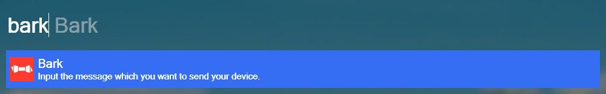

# Wox.Plugin.Bark

Bark for Wox.

## Bark

> Bark is an iOS App which allows you to push customed notifications to your iPhone.

More information about Bark for https://github.com/Finb/Bark.

## Attention

- You should input in your **device api key** to [constant.py](/bark/constant.py) before you key in the message.
- It is better to paste the message in Wox. If you input the message one by one, Wox would send the message one by one also. There are not **Enter** in Wox. `¯\_(ツ)_/¯ `

## Requirements

- Python3.x
- requests
